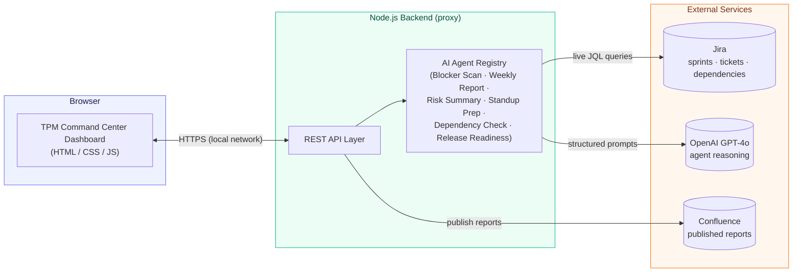
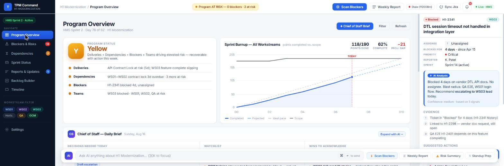
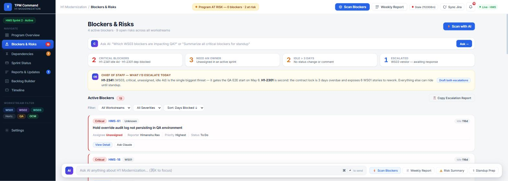
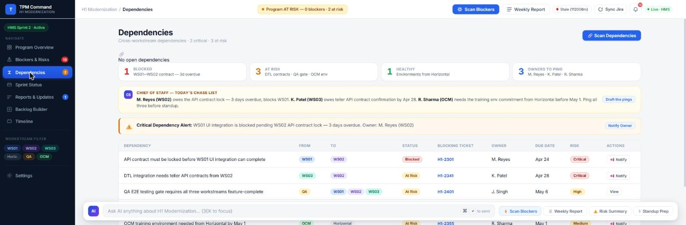
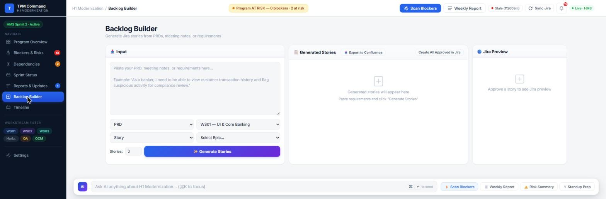
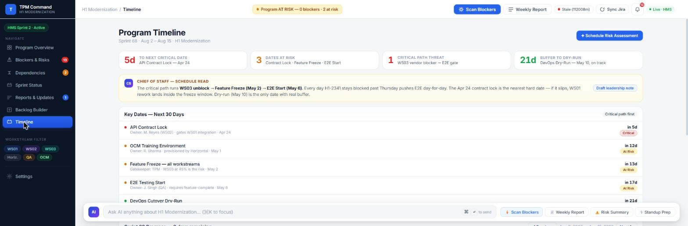

# Program Management AI Command Center

An AI-assisted **Technical Program Manager (TPM) copilot** built for large-scale, multi-workstream programs. It sits on top of live Jira + Confluence data and gives a TPM (or an engineering leadership team) a single command center for sprint health, blockers, cross-team dependencies, backlog generation, and executive reporting — with an AI "Chief of Staff" layer that proactively surfaces what needs attention today.

> This repo is a **showcase** of the project — architecture, design, and a working demo. 
---

## Why this exists

Running a large modernization program across 6+ workstreams (UI, backend APIs, third-party integrations, DevOps, QA, and change management) generates a constant stream of signals — blocked tickets, slipping dependencies, stale sprints — that a human TPM has to manually triage every day. This project explores how far an AI-assisted workflow can go in automating that triage: pulling live data from Jira, reasoning over it the way a senior TPM would, and turning it into ready-to-use artifacts (status reports, escalation notes, generated backlog items) instead of just a dashboard of numbers.

---

## What it does

- **Program Overview** — sprint burnup, program health rating, and an AI-generated "Chief of Staff" daily brief (decisions needed today, watchlist, wins to acknowledge).
- **Blockers & Risks** — live blocker inventory across workstreams, auto-scored by severity/idle time, with AI root-cause analysis and suggested next actions per ticket.
- **Dependencies** — cross-workstream dependency tracker (who's blocking whom, due dates, risk level) with one-click owner escalation.
- **Backlog Builder** — paste a PRD, meeting notes, or raw requirements and generate structured Jira stories (with acceptance criteria and story points), preview them, and push approved ones straight into Jira.
- **Timeline** — critical-path view of key program dates with AI-generated schedule risk commentary.
- **AI agents on demand** — blocker scans, weekly status reports, risk summaries, daily standup prep, dependency checks, and release-readiness assessments, all generated from live Jira data rather than static templates.

## How it's built

- **Frontend:** a single dashboard UI (vanilla HTML/CSS/JS) — no framework overhead, fast to iterate on with AI-assisted edits.
- **Backend:** a lightweight Node.js server acting as a secure proxy — it holds Jira/Confluence/OpenAI credentials server-side and exposes a small REST API to the dashboard, so no API keys are ever shipped to the browser.
- **AI layer:** OpenAI (GPT-4o) agents, each with a role-specific system prompt (e.g. "Blocker Scan", "Weekly Status Report"), fed live Jira context pulled just-in-time via JQL.
- **Data sources:** Jira (sprints, tickets, dependencies) and Confluence (published reports), via Atlassian's REST API / MCP.

### Architecture

**Key design choice:** the browser never talks to Jira, Confluence, or OpenAI directly — every request goes through the Node backend. This keeps the dashboard safely shareable/screenshot-able without any risk of leaking credentials.

---

## Screenshots

**Program Overview** — sprint burnup, program health, and the AI Chief of Staff daily brief

**Blockers & Risks** — live blocker inventory with AI root-cause analysis

**Dependencies** — cross-workstream dependency tracker with escalation actions

**Backlog Builder** — generate Jira stories from raw requirements

**Timeline** — critical-path schedule view with AI risk commentary

---

## Demo

https://github.com/user-attachments/assets/REPLACE-WITH-UPLOADED-VIDEO-ID

*(To add your video: open this README file directly on GitHub.com in edit mode and drag-and-drop your `.mp4` into the text box — GitHub uploads it and inserts a working embed link automatically. Simpler alternative: upload to YouTube/Loom unlisted and paste the link here.)*

---

## Disclaimer

The program, teams, tickets, and data shown in the screenshots/demo are from a demo/practice program used to build and test this tool — not real client or production data. No API keys, tokens, or credentials are included anywhere in this repository.
